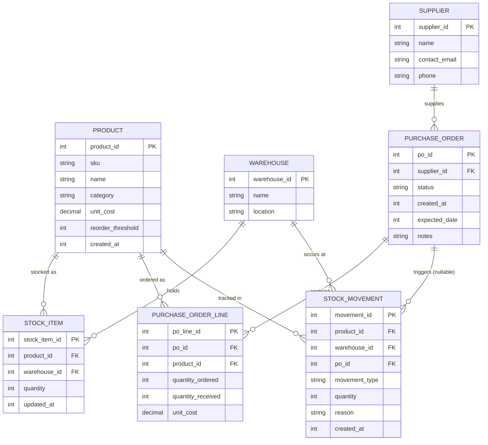

# ER Diagram

Notes:
- `STOCK_ITEM` has a unique constraint on (product_id, warehouse_id).
- `STOCK_MOVEMENT.movement_type` ∈ {IN, OUT, TRANSFER_OUT, TRANSFER_IN, ADJUSTMENT}.
- `PURCHASE_ORDER.status` ∈ {DRAFT, SENT, PARTIALLY_RECEIVED, RECEIVED, CANCELLED} — driven by the State pattern.
