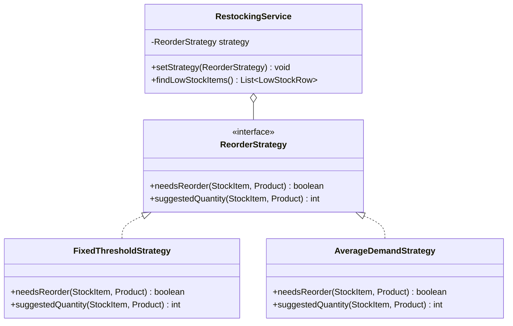
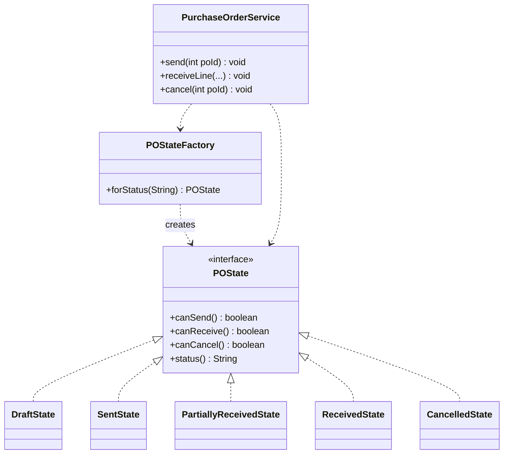
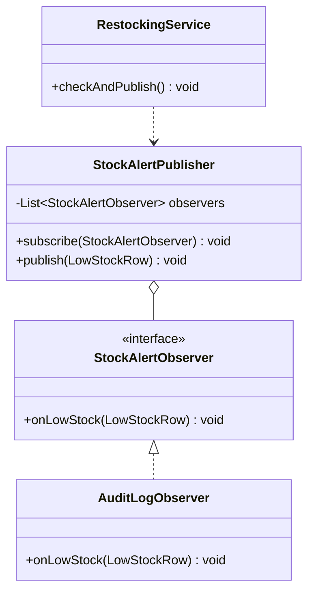
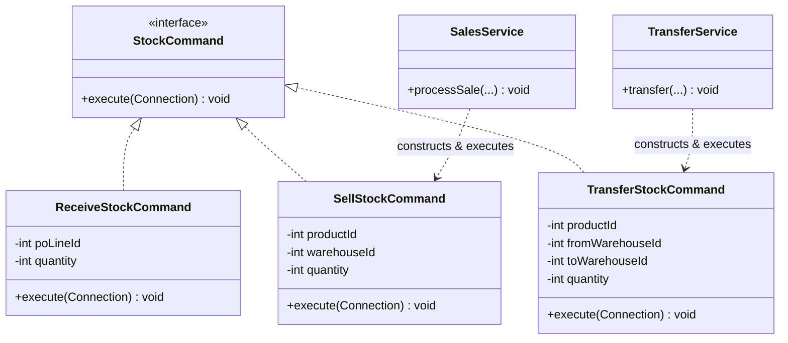
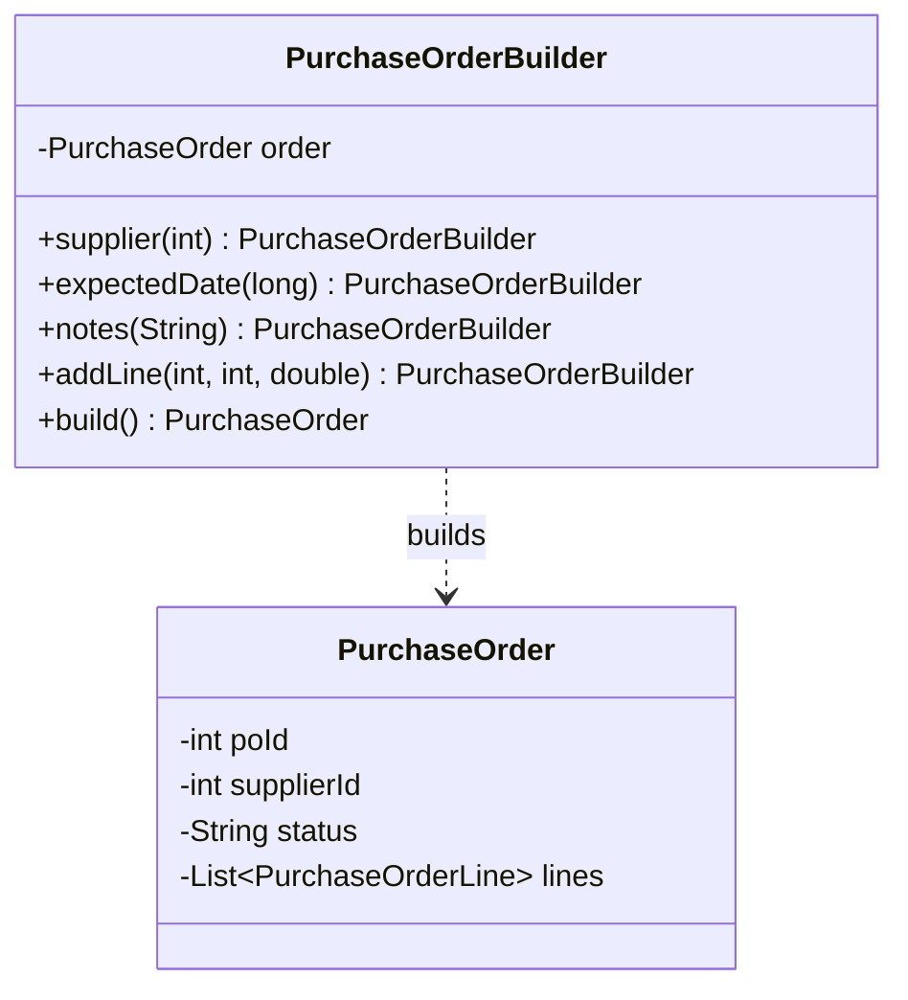
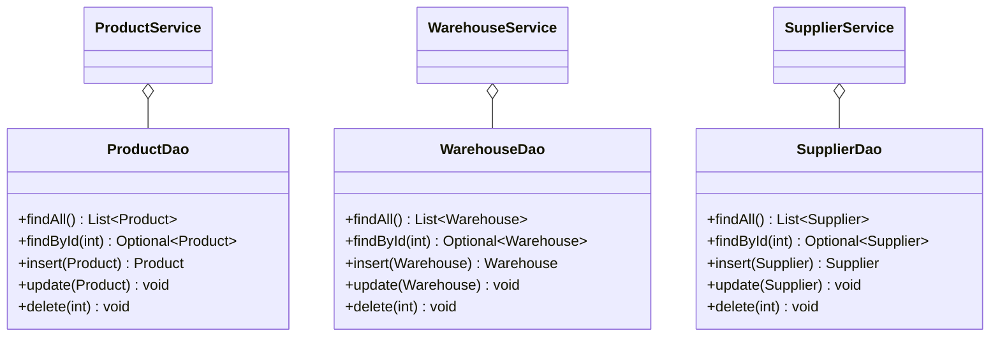

# UML Class Diagrams

These diagrams cover the class structures behind the major design decisions
discussed in `03-design-patterns.md`. The plain CRUD entities (`Product`,
`Warehouse`, `Supplier`) are omitted since they have no interesting
structure — see `02-er-diagram.md` for their data shape instead.

## Strategy — Reorder Calculation

## State — Purchase Order Status

## Observer — Low-Stock Alerts

## Command — Stock Adjustments

## Builder — Purchase Order Construction

## DAO / Repository — Persistence Layer

Note: DAOs don't share a common generic interface (no `Dao<T>` superclass).
That was a deliberate choice, not an oversight — each entity's persistence
needs differ enough (e.g. `PurchaseOrderDao` needs an externally-supplied
`Connection` for transactional multi-table writes; `ProductDao` doesn't)
that a forced common interface would need awkward unused methods or
overly generic signatures, which is exactly the kind of pattern-for-its-own-sake
the project brief warns against.
